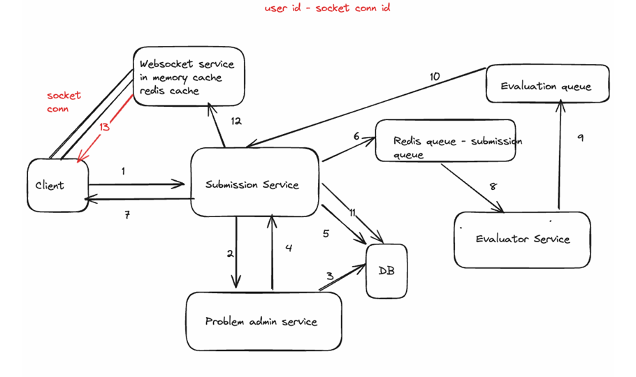

# Algocode Backend 

This is the architecture of this Microservices project.

## Workflow

1. Client sends a request to submission service.
2. Submission service request in a sync fashion to problem admin service to fetch the problem details.
3. Problem admin service queries the mongodb to fetch the problem details.
4. Problem admin service send the problem details back to the submission service.
5. We make a submission entry in the db.
6. Submission service adds the submission payload with the updated stub in the redis queue.
7. Sends a response back to client that submission has been made.
8. Evaluator service picks the message from the queue and evaluate the code.
9. Now evaluator service will do the test case matching and whatever is the status of the submission it will add it to the another redis queue.
10. Submission service will take evaluation from the evaluation queue.
11. Submission service will make a call to the db and update submission details.
12. Submission service will notify the websocket service about the updated status of the problem.
13. Websocket service will send a message about the code execution to the client.